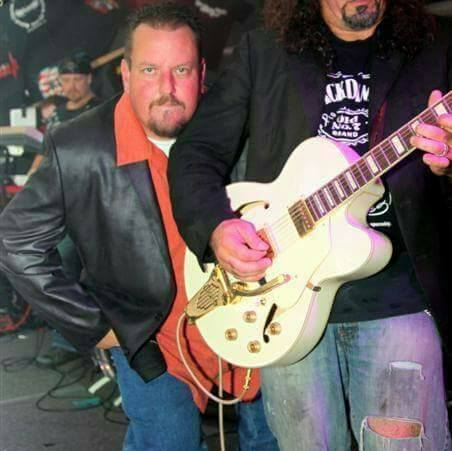

<!DOCTYPE html>
<html lang="en">
<head>
    <meta charset="UTF-8">
    <title>CSD 340 Web Development with HTML and CSS</title>

    <link rel="stylesheet" type="text/css" href="home.css">
    <link href="https://fonts.googleapis.com/css2?family=Oswald:wght@300;400;500;700&display=swap" rel="stylesheet">
</head>
<body>
<h1>Assignment 7.2: Build a Web Page - Part 5</h1>

    <h1 id="page-title">CSD 340 Web Development with HTML and CSS</h1>
    <a id="home">Home</a>
    <a id="about">About</a>
    <a id="contact">Contact</a>
        

            <h3 class="gallery-title">Singer at the Blues House</h3>
            <body>This is my father. He is in his mid-50’s and is born and raised in Massachusetts. He is a singer in band that plays mostly funk style music and he is the lead singer. For his day-to-day job, however, he is a seller of restaurant equipment. He sells and negotiates deals with various food shops and trucks around the northeastern part of the country and sells his equipment alongside his colleagues. He is the co-owner of his company and has been doing this form of work since he was a teenager. He loves working with food and his favorite meal is lasagna and beef. When he is not working on his job or singing with his band, he will usually be relaxing at home with his wife or going camping. 
                I chose to make this website dedicated to him because he is someone I know very well and would be able to develop a lot of content about over the course of this websites production. Also, being a relative, he is less likely to feel uncomfortable with me depicting him online to my school than say, a friend or colleague. I did receive his permission and one of the photos he took just for me to use on this website. I will document and interview various stages of his life throughout the project and see how his work in the industry is going and what kind of advice he can give to people who are interested in selling restaurant equipment.
                </body>
            <figure>
                

                <figcaption>(Billy 2)</figcaption>
            </figure>

        

        
        

            <h3 class="gallery-title">In a Band</h3>

            <figure>
                

                <figcaption>(Billy 1)</figcaption>
            </figure>

        

        
        

            <h3 class="gallery-title">Singing with his Band</h3>

            <figure>
                

                <figcaption>(Billy 5)</figcaption>
            </figure>

        

    

</body>
</html>
